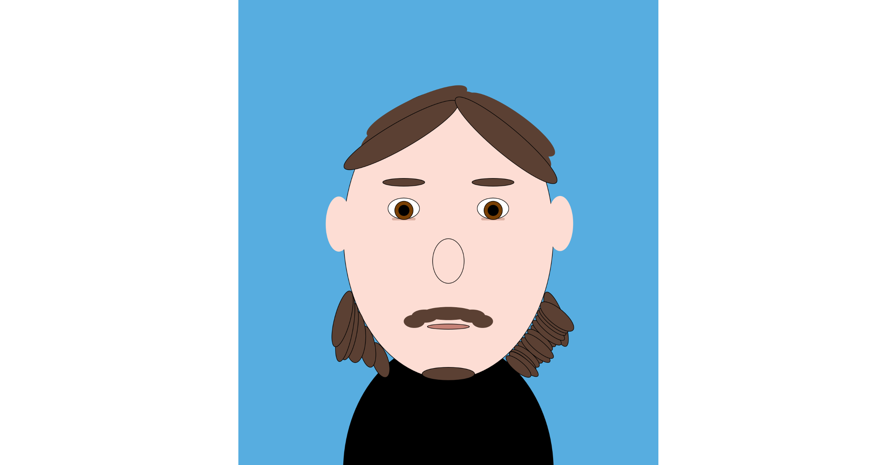
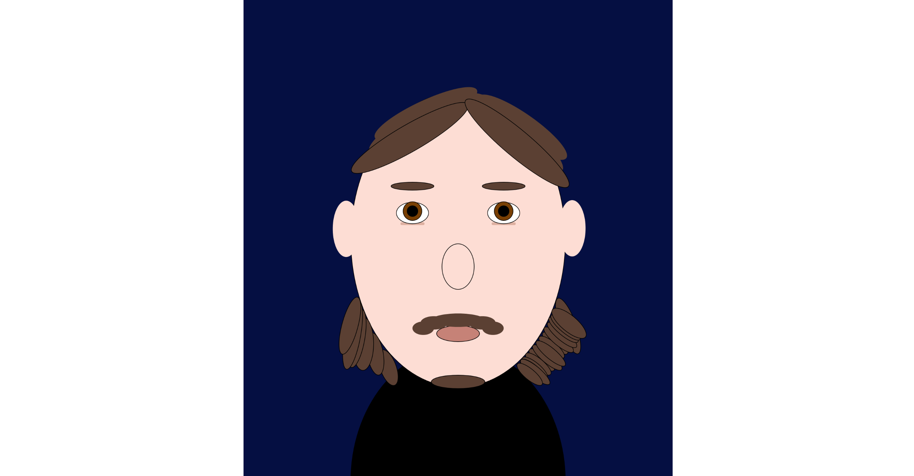

# ART JAM

MATIA PAKI

[View this project online](URL_FOR_THE_RUNNING_PROJECT)

## Description

This description should help the reader understand what the program is, anything they should know to be able to experience it (controls, special features, etc.), and what the desired user experience is. For example:

> *This Art Jam is a self portrait of myself, blended with interactivity in which the eyes will follow your mouse. The mouth will also change depending on where your mouse is vertically on the canvas! The background also changes overtime.

> Function I used that I never used beforehand is line().

## Screenshot(s)

This bit should have some images of the program running so that the reader has a sense of what it looks like. For example:

> 

> 

## Attribution

This bit should attribute any code, assets or other elements used taken from other sources. For example:

> - This project uses [p5.js](https://p5js.org).
> - This project is a self portrait of my face. :D