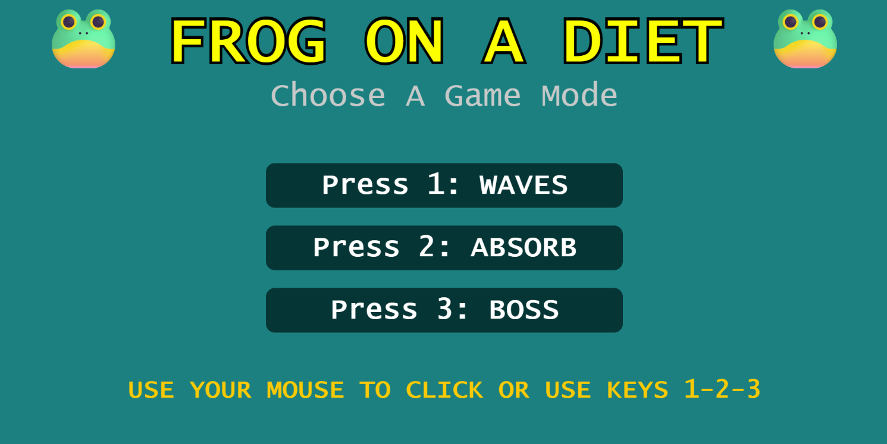
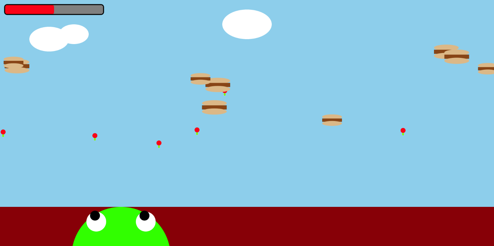
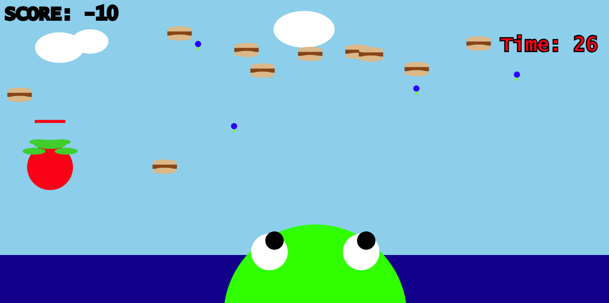

# TITLE OF PROJECT

MATIA PAKI

[View this project online](https://matiamp.github.io/cart253/variation-jam/)

## Description

> *Waves* is a version of the frog game I made. But in this variation, there is a timer that was added of 30 seconds as well as a boss that spawns, it takes 3 tongue hits to eat the boss which will give the user 5 points. If the boss hits the frog, it will deduct 5 points. The user wins at 15 points and loses at -15 points. Controls: Mouse or arrow keys to move, left click or spacebar to shoot tongue out.

> *Absorb* is a version of the frog game I made. But in this variation, instead of using its tongue to eat, the user must use the frogs body to interact with the food. The user must reach a score of 20 to win, and -20 to lose. Move around with the arrow keys or with the mouse. Controls: move frog around with arrow keys or with mouse.

> *Boss* is a version of the frog game I made. But in this variation, there is a timer that was added of 30 seconds as well as a boss that spawns, it takes 3 tongue hits to eat the boss which will give the user 5 points. If the boss hits the frog, it will deduct 5 points. The user wins at 15 points and loses at -15 points. Controls: Mouse or arrow keys to move, left click or spacebar to shoot tongue.

## Screenshot(s)

This bit should have some images of the program running so that the reader has a sense of what it looks like. For example:

> 
> 
> 
> 

## Attribution

This bit should attribute any code, assets or other elements used taken from other sources. For example:

> - This project uses [p5.js](https://p5js.org).
> - The good eating sound effect is "8-bit Arcade Mode" by moodmode from pixabay.com: https://pixabay.com/music/video-games-8-bit-arcade-mode-158814/

## License

This bit should include the license you want to apply to your work. For example:

> This project is licensed under a Creative Commons Attribution ([CC BY 4.0](https://creativecommons.org/licenses/by/4.0/deed.en)) license with the exception of libraries and other components with their own licenses.

> Made by Matia Paki, CART253, 2025